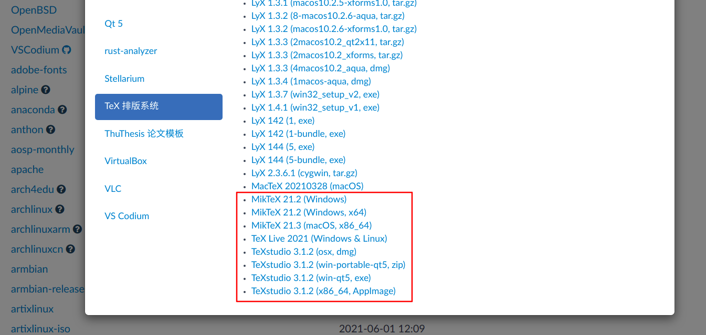

# 初识 LaTeX

LaTeX 是一个高质量的排版系统，包括专为技术生产和科学文档而设计的功能，是沟通和出版科学文档的标准。LaTeX 是一个免费软件。[参考[LaTeX官网](https://www.latex-project.org/)]

不像 Microsoft Word、LibreOffice Writer 和 Apple Pages 这类“所见即所得”的排版软件，LaTeX 使用纯文本编写文档。编写者使用命令定义文档的整体结构（文章、书籍、信函等），使用命令对格式化文本（粗体、斜体等），使用命令添加参考文献和交叉引用。

LaTeX 被广泛应用于学术界的许多领域，包括数学、统计学、计算机科学、工程学、物理学、经济学、语言学、定量心理学、哲学、政治学等。在出版复杂的多语言书籍和文章（如梵语和希腊语）时，LaTeX 同样发挥着重要作用。[参考[LaTeX的维基百科](https://en.wikipedia.org/wiki/LaTeX)]

简要说明一下 `TeX` 和 `LaTeX` 的区别，TeX 提供格式，面向模板设计者，而 LaTeX 提供内容，面向文档编写者。

`TeX` 是一个排版系统，提供了许多命令，支持指定非常详细的文档格式（字体样式、行间距、字间距、连字等），有专门的算法来计算最佳文本流（换行、分页等）。TeX提供了强大的算法和命令来自定义哪怕很微不足道的细节，这使得文档看起来非常漂亮。

`LaTeX` 是在 TeX 的基础上定义的一系列宏命令。LaTeX 的核心思想是将焦点从文档格式转移到文档内容上来。LaTeX 中的命令都是为文档内容提供结构（章节、重点、表格、索引等）。在 LaTeX 中，一个命令可以完成许多格式的设置操作，例如 `\section{...}` 命令会为章节选择更大的字体、应用不同的字体样式、在标题前后插入适当的空格。由于 LaTeX 是建立在 TeX 的基础上的，因此输出的文档也是非常漂亮的。但更重要的是，LaTeX 的源输入也具有良好的文档结构，易于阅读和编写。[参考[StackExchange](https://tex.stackexchange.com/questions/49/what-is-the-difference-between-tex-and-latex)]


# LaTeX 发行版

LaTeX 的许多特性和编程语言非常像，如果熟悉编程语言的话，下面的内容将会非常好理解。

在使用 Java 或 Python 等高级语言编程时，我们编写的程序被称为 `源文件`，需要在 `运行环境` 中编译并运行。对于 Java 来说，需要先使用 JDK (Java Development Kit) 编译 .java 源文件成 .class 字节码文件，再使用 JRE (Java Runtime Environment) 运行 .class 字节码文件。对于 Python 来说，可以直接使用 Python 解释器 (Python Interpreter) 运行 .py 源文件。

为了获得更好的编程体验，我们会使用集成开发环境 (`IDE`, Integrated Development Environment) 来提高编程效率。IDE 提供了诸如自动补全、静态错误检测、断点调试、性能分析等实用功能，一个好的 IDE 往往能起到事半功倍的效果。目前常用的 Java 集成开发环境有 IntelliJ IDEA，Python 集成开发环境有 PyCharm。

事实上，我们在编程时，往往会调用许多`包` (package)，这些包往往也会构成我们运行环境的一部分。因此，`包管理工具` 应运而生，例如 Java 的 Maven 和 Python 的 Anaconda （Anaconda是conda的一个发行版）。


LaTeX 也是如此，LaTeX 有许多发行版，这些发行版不仅提供了 LaTeX 的核心命令，还提供了包管理功能。几个免费的 LaTeX 发行版列举如下[参考[tug.org](http://www.tug.org/interest.html#free )]：

- [TeX Live](http://www.tug.org/texlive/ )：大多数 TeX 用户组提供的发行版，支持许多 Unix 系统、MacOSX 系统和 Windows 系统。
- [MacTeX](http://www.tug.org/mactex/ )：支持 MacOSX 系统，在 TeX Live 的基础上附加了一些功能，安装更容易。
- [MiKTeX](https://miktex.org/ )：一个独立发行版，具有灵活的包管理功能。
- [proTeXt](http://www.tug.org/protext/ )：在 MiKTeX 的基础上附加了一些功能，含有 Windows 系统的安装指南。
- [KerTeX](http://www.kergis.com/en/kertex.html )：一个 TeX 内核系统，来自 Thierry Laronde。
- [Knoppix](http://www.knopper.net/knoppix/index-en.html )：一个允许光盘启动的包含 TeX 的 GNU / Linux 系统。
- [TeX-FPC](https://ctan.org/pkg/tex-fpc )：一个可与 Free Pascal 编译器和安装脚本一起使用的 TeX 修改版本，来自 Wolfgang Helbig。
- [Wallstone Creativity Desktop](https://sourceforge.net/projects/publishersdistro/ )：一个用于处理文档、照片、视频、项目规划等内容的大型免费软件集合，其中就包括 (La)TeX。

本教程中，我们选择 MiKTeX 作为运行环境，Tex Studio 作为 IDE。

# MiKTeX 和 Tex Studio 的下载和安装

我们提供了三种下载安装 MiKTeX 和 Tex Studio 的方法。其中，方法一直接从官网下载软件包到本地进行安装，如果网速较慢可选择方法二，使用清华镜像源下载软件包，方法三针对部分 Linux 系统用户，可直接使用 `apt` 命令进行安装。

## 方法一：官网

MiKTeX 的官网是 [miktex.org](https://miktex.org/ )，点击顶部的 `DOWNLOAD` 按钮进入下载页面，选择对应操作系统的安装包。


Tex Studio 的官网是 [texstudio.org](https://www.texstudio.org/ )，点击左侧的 `Download` 按钮跳转到下载页面，选择对应操作系统的安装包。


## 方法二：清华镜像

如果方法一中的官网打不开或者下载速度较慢，可以从清华大学开源软件镜像站中下载安装包。访问 [mirrors.tuna.tsinghua.edu.cn](https://mirrors.tuna.tsinghua.edu.cn/ )，点击右侧的 `获取下载链接` 按钮。


在弹出的对话框中，选择 `应用软件` 选项卡，在左侧选择 `TeX 排版系统`，下载对应操作系统的 MiKTeX 和 Tex Studio 安装包。



## 方法三：apt 安装

对于部分支持使用 `apt` 命令的 Linux 系统用户，可直接使用如下命令安装：

```shell
apt install miktex texstudio
```


# 第一个 LaTeX 文档

确保正确安装了 MiKTeX 和 Tex Studio 之后，我们就可以开始编写第一个 LaTeX 文档啦！！！

1. 打开 Tex Studio。

2. 点击 `File` 菜单的 `New` 选项，新建一个文件（或者使用快捷键 `ctrl + N` ）。

3. 点击 `File` 菜单的 `Save` 选项，选择一个路径保存文件（或者使用快捷键 `ctrl + S` ）。这是一个好习惯，新建文件后立即保存，没事按按 `ctrl + S`，不要等到软件未响应了才追悔莫及。

4. 在编辑器中输入如下内容：

```latex
\documentclass{article}

\title{Hello \LaTeX}
\author{enderman19980125}
\date{2021.06.02}

\begin{document}
	\maketitle
	This is my first \LaTeX document.
\end{document}
```

5. 点击 `Build & View` 按钮（一个类似“快进键”的按钮，由两个绿色的三角形叠加而成），等待一小会儿，生成的 pdf 文档会显示在右侧。


Congratulations！我们已经实现了第一个 LaTeX 文档！如果这个教程对你有帮助的话，记得点个赞哦，感谢！