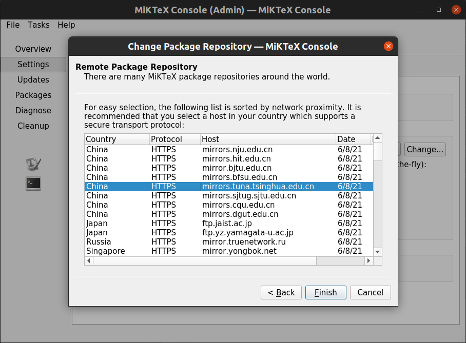
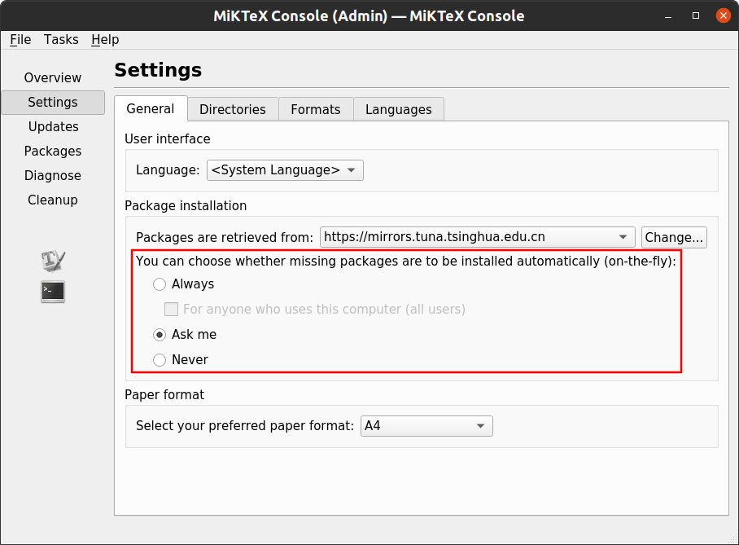
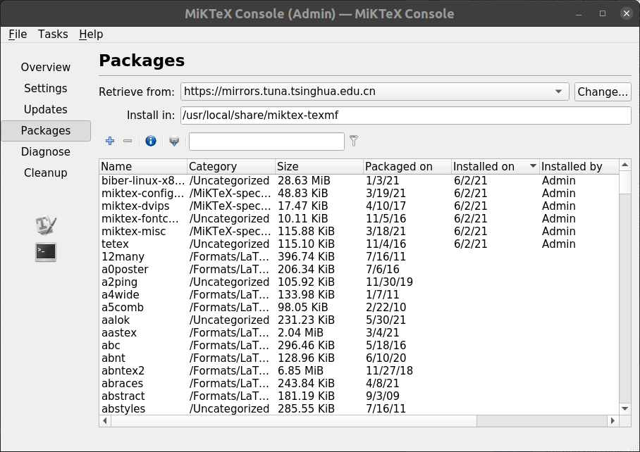
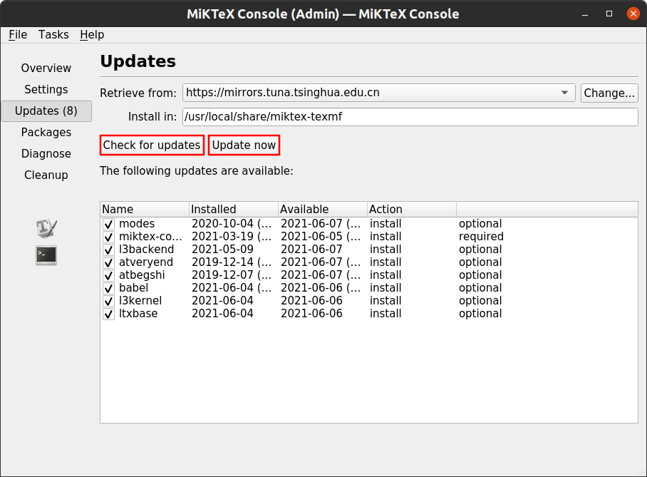
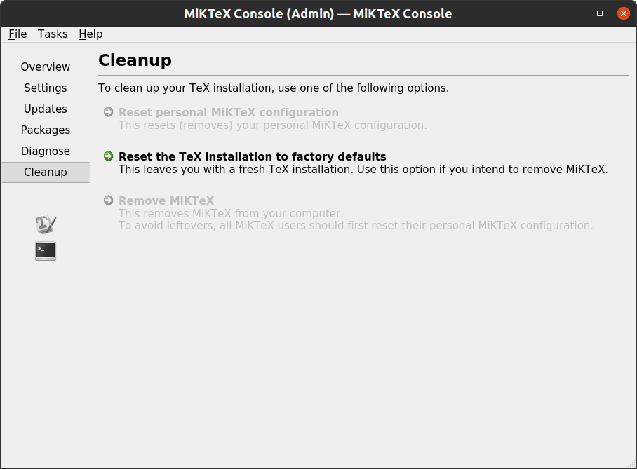

# 首次使用

打开 MiKTeX 控制台，首次使用会弹出一个警告窗口，意思是说，到目前为止，还没有检查更新。不必理会它，直接关掉就行。

# 普通模式和管理员模式

在 `Overview` 界面会让你选择用户身份，可以是“管理员模式”，也可以是“普通用户模式”。当选择管理员模式时，会进行身份验证。

区别在于，管理员安装的包对所有用户可见，设置对所有用户有效，而普通用户安装的包仅对自己可见，设置仅对自己有效。当然普通用户可以覆盖管理员的设置，但这也仅对自己有效。管理员安装包的路径在系统中（比如我的路径是 `/usr/local/share/miktex-texmf` ），而普通用户安装包的路径在用户文件夹中（比如我的路径是 `/home/administrator/.miktex/texmfs/install`，其中 administrator 是我的用户名）。

不过现在基本人手一台电脑，一般一台电脑只会用一个账户登录，可以不用在意这些。除非你像我一样有强迫症，就喜欢所有包安装在系统路径中，或者电脑中会有多个账户登录。

# MiKTeX 设置

我这边以管理员模式登录，下面介绍 MiKTeX 控制台的一些常用设置。在熟练了之后，你可以摸索一下其它设置。

## 换源

默认情况下，MiKTeX 会随机从互联网上的远程仓库中下载包，但有时候远程仓库在国外，下载速度就会很慢。所以建议使用国内的镜像源。

切换到 `Settings` 界面，在`Package installation` 设置中，点击 `Packages are retrieved from` 选项的 `Change...` 按钮。

弹出 `Change Package Repository` 对话框，保持默认设置，即选择 `Remote package repository (Internet)` ，点击 `Next` 按钮进入下一步。

等待几秒钟，这里会列出所有远程仓库的地址。在2021年06月04日访问时，国内的镜像源共有六个，分别是：

- [哈尔滨工业大学开源镜像站](http://mirrors.hit.edu.cn/)
- [南京大学开源镜像站](https://mirrors.nju.edu.cn/)
- [上海交通大学软件源镜像服务](https://mirrors.sjtug.sjtu.edu.cn/)
- [北京外国语大学开源软件镜像站](https://mirrors.bfsu.edu.cn/)
- [重庆大学开源软件镜像站](https://mirrors.cqu.edu.cn/)
- [东莞理工学院镜像站](https://mirrors.dgut.edu.cn/)

这里我选择南京大学的镜像源，点击 `Finish` 按钮完成设置。

回到 `Settings` 界面，看到远程仓库地址设置成功。

## 自动安装缺失包

我们可以设置是否自动安装缺失包。MiKTeX 提供了三种遇到缺失包时的行为：

- `Always`：自动安装缺失包。有时候编译 LaTeX 文档会很慢，很可能就是缺失了某些包。这时需要等到所有的缺失包（包括所有缺失的依赖包）都下载完，才能进行编译。但是下载过程不会有进度显示，所以耐心等待几分钟吧。

- `Ask me`：安装缺失包时弹出对话框。安装每个缺失包之前，都会弹出一个对话框进行确认。如果缺失包比较多，反复弹出十几个窗口也不是不可能。

- `Never`：从不安装缺失包。这时编译 LaTeX 文档会出错，需要自己手动前往 MiKTeX 控制台安装缺失包。

这里，我一般习惯使用 `Ask me` 模式。

## 安装包

在 `Packages` 界面，可以进行包管理的相关操作。如果一个包已安装，那么 `Installed on` 和 `Installed by` 两列会分别显示包安装的时间和用户。想要安装或删除一个包，可以先在搜索框中搜索包名，然后点击 `+` 安装或 `-` 删除。

例如，我们搜索 “cjk” 并安装五个以 “cjk” 开头的包，选中要安装的包 （ `ctrl` 多选，`shift` 连选，就像选择文件一样），点击 `+` 安装。在弹出的对话框中，会显示安装进度。等到右下角的按钮从 `Cancel` 变成 `Close` 时，说明安装过程完成。

## 更新包

在 `Updates` 界面，可以进行包更新的相关操作。点击 `Check for updates` 按钮会检查所有已安装包的更新情况，可更新的包会出现在下面的列表里。点击 `Update now` 会下载并安装所有可更新的包。默认会更新所有可更新的包，如果不想更新某些包，可以手动取消其复选框的勾。

## 恢复初始设置

在 `Cleanup` 界面，可以进行一些清理操作。第一个选项是重置个人用户的 MiKTeX 配置，第二个选项是将整个 MiKTeX 环境恢复到初始状态，第三个是卸载 MiKTeX。

