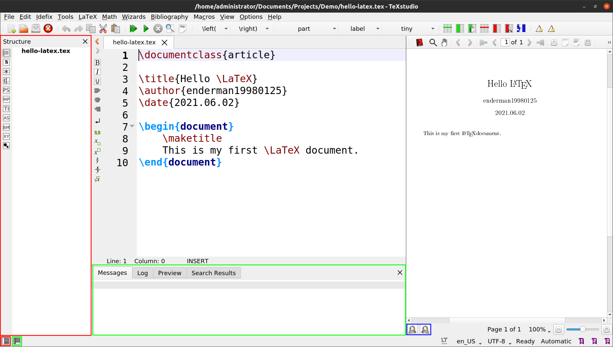
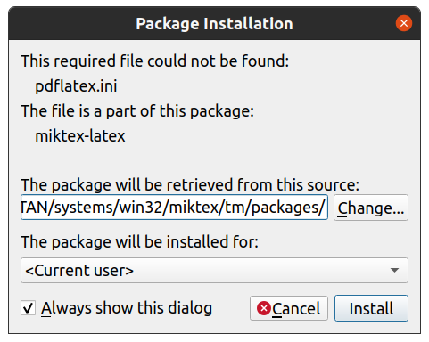
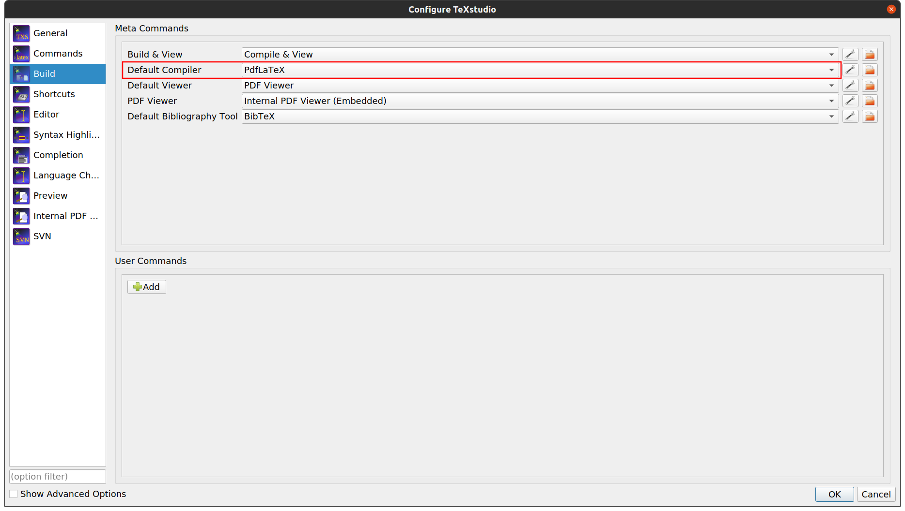
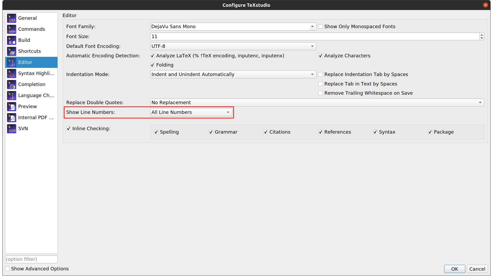

# Tex Studio 界面

我们简要介绍一下 Tex Studio 软件的界面，分享一些实用的功能。

## 左侧窗口

点击左下角的第一个按钮，可以开启或关闭左侧窗口（图中红框）。左侧窗口提供了文档导航和快速输入的功能。点击左侧一列的按钮可以切换不同的功能界面，图中左侧窗口显示的是 `Structure` 界面。每个功能界面简要介绍如下：

- `Structure` 界面：显示文档结构；
- `Bookmarks` 界面：显示书签；
- `Symbols` 界面：快速输入各种符号；
- `Left/Right Brackets` 界面：快速输入各种括号；
- `PS` 界面、`MP` 界面、`TI` 界面、`AS` 界面、`BM` 界面、`XY` 界面：快速输入各种类型的命令；
- `Macros` 界面：宏定义，初始是空的，需要自己定义宏；

## 消息日志窗口

点击左下角的第二个按钮，可以开启或关闭消息日志窗口（图中绿框）。在启动编译后，`Messages` 窗口会输出编译进度和错误信息，`Log` 窗口会显示详细的编译日志，记录错误发生的行号，方便排查。

## 安装缺失包

我在 MiKTeX 中设置了自动安装缺失包的 `Ask me` 模式，因此每个缺失包在安装前都会弹出对话框。在对话框中，可以更换远程仓库地址，选择安装域（当前用户 or 所有用户）。

# Tex Studio 配置

点击菜单栏中的 `Options` 下拉列表，选择 `Configure TeXstudio` 选项，可以打开 Tex Studio 的配置界面。可以进行更改界面外观、修改快捷键、编辑命令行等操作。我们介绍一些实用的配置。

## 编译器

在 `Build` 界面中，选项 `Default Compiler` 可以更改默认的编译器。Tex Studio 默认的编译器是 `PdfLaTeX`，如果需要撰写中文的 LaTeX 文档，需要切换到 `XeLaTeX` 编译器，这在后面的教程中会有详细的介绍。

## 行号

在 `Editor` 界面中，选项 `Show Line Numbers` 可以启用或禁用行号。个人建议打开行号显示，这样交流和调试的时候会比较方便。

