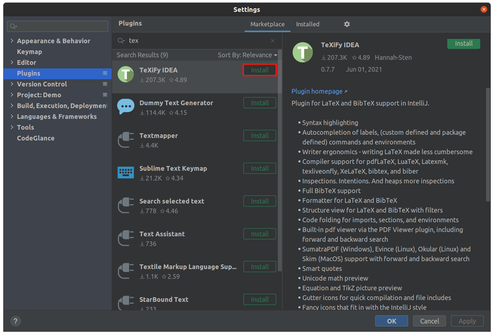
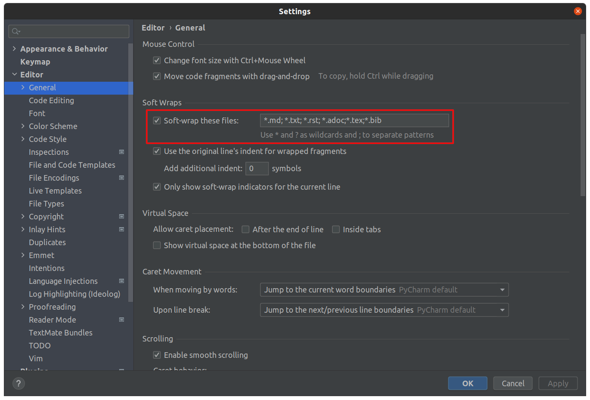
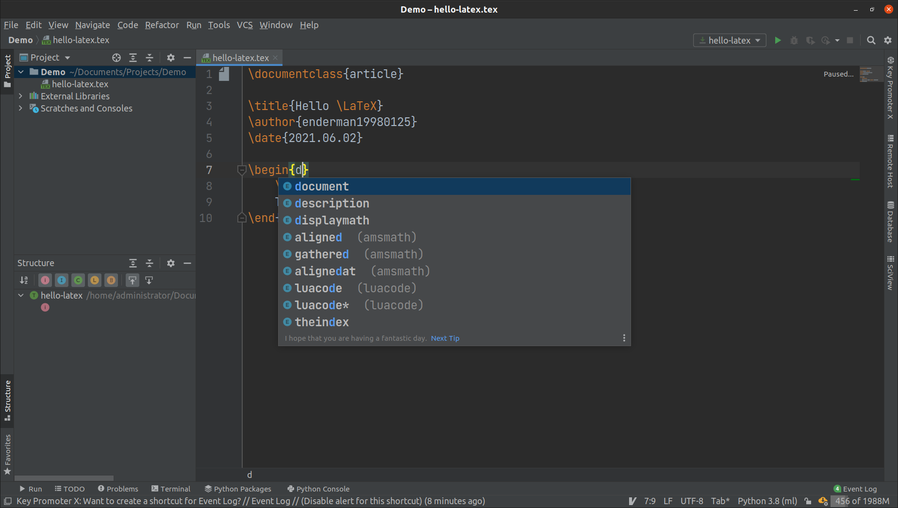
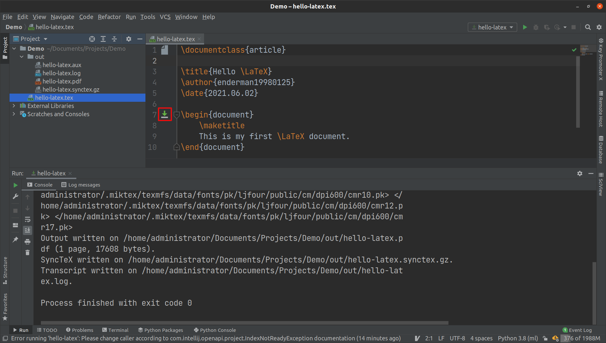

# 在 IDEA 中安装 TeXiFy-IDEA 插件

啊哈，没错！我们可以在 IDEA 中撰写和编译 LaTeX 文档！

事实上，[JetBrains 全家桶](https://www.jetbrains.com/products) 中的软件都可以安装 [TeXiFy-IDEA](https://plugins.jetbrains.com/plugin/9473-texify-idea) 插件。虽然我标题写的都是 IDEA 软件，但细心的读者会发现，我演示截图实际用的是 PyCharm 软件。我个人很喜欢用 PyCharm 撰写 LaTeX 文档，嘿嘿！

下面我们来安装 TeXiFy-IDEA 插件。先新建一个工程，在 `File` 菜单中点击 `Settings` 选项，打开设置窗口。选择 `Plugins` 选项，打开插件管理界面。

点击 `Marketplace` 选项，搜索 “tex”，结果中的第一条就是我们要的 TeXiFy-IDEA 插件，点击 `Install` 按钮安装。安装完成后，需要重启软件，插件才能生效。



注意，在撰写 LaTeX 文档的过程中，可能一行文字已经超出了显示范围，却没有自动换行。这是因为在软换行设置中，没有把 LaTeX 文档添加进去。在设置窗口中，选择 `Editor` 选项的 `General` 子选项，在 `Soft-wrap these files` 的输入框中，需要把 “\*.tex” 和 “\*.bib” 两种类型的文件添加进去，注意使用分号 “;” 作为分隔符。



# 在 IDEA 中撰写 LaTeX 文档

新建一个以 “.tex” 结尾的文件，此时软件会自动识别该文件为 LaTeX 文档文件。和前面的教程一样，我们在编辑器中输入如下内容：

```latex
\documentclass{article}

\title{Hello \LaTeX}
\author{enderman19980125}
\date{2021.06.02}

\begin{document}
	\maketitle
	This is my first \LaTeX document.
\end{document}
```

可以看到，LaTeX 语法会高亮显示，代码有自动补全，`Structure` 面板可以显示文档结构，就像 Tex Studio 一样！



# 在 IDEA 中编译 LaTeX 文档

在 `\begin{document}` 行的前面，会有一个形似 `下载` 的按钮，点击该按钮就能编译当前文件。

默认情况下，软件会在当前工作路径下新建一个 `out` 文件夹，所有的输出文件都会被放在 `out` 文件夹中，生成的 pdf 文件也在其中。嗯，这个输出很 Java！


