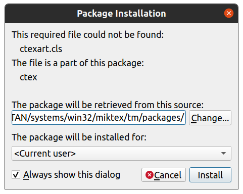
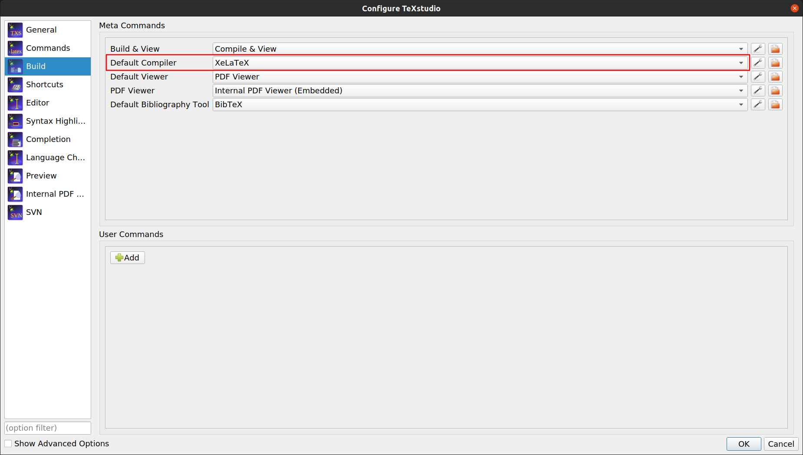
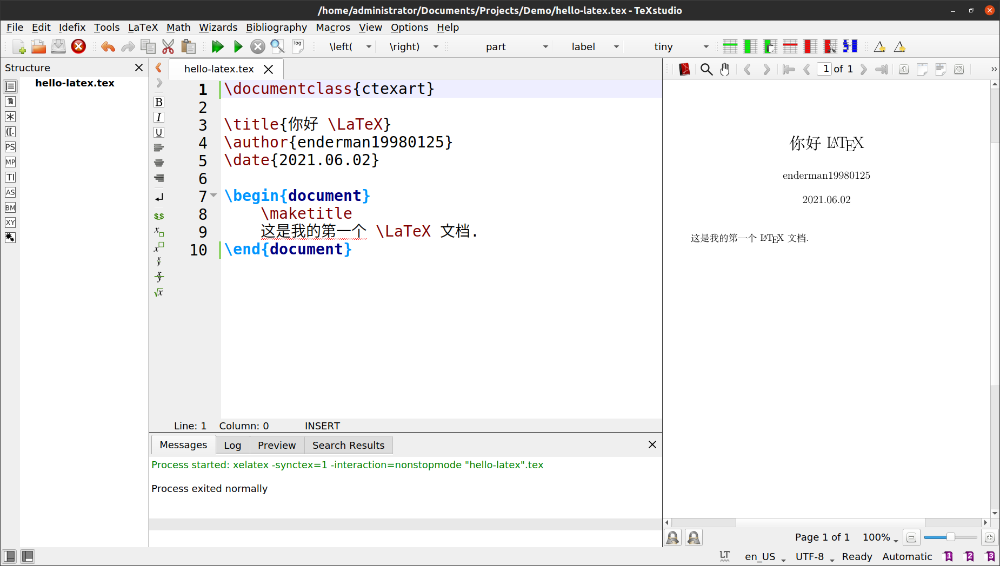
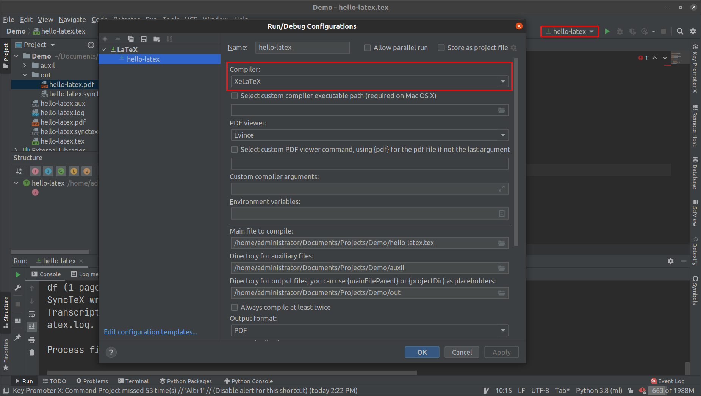
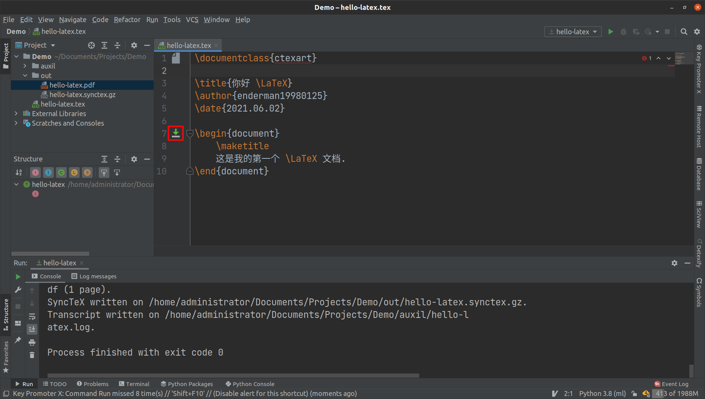

# LaTeX 中文支持

我们有多种方法在 LaTeX 中输入中文。本教程使用 `ctex` 宏包和 `XeLaTeX` 编译器实现 LaTeX 的中文支持。

# Tex Studio 中文支持

在 Tex Studio 中，输入以下内容：

```latex
\documentclass{ctexart}

\title{你好 \LaTeX}
\author{enderman19980125}
\date{2021.06.02}

\begin{document}
	\maketitle
	这是我的第一个 \LaTeX 文档.
\end{document}
```

注意到，第一行大括号中的内容，之前是 `article`，现在变成了 `ctexart`，这是 “ctex article” 的缩写。

编译文档，如果你之前没有在 MiKTeX 中安装全部的宏包，此时就会遇到包缺失的问题。我在 MiKTeX 中，设置了遇到缺失包时，总是 `Ask me`，因此会弹出安装缺失包的对话框。安装完 `ctex` 宏包后，还要继续安装其它若干个依赖包。



处理完包缺失问题后，编译文档会报错。这是因为我们默认使用的 LaTeX 编译器是 `PdfLaTeX`，而该编译器不支持 ctex 使用的中文字体[参考[StackExchange](https://tex.stackexchange.com/questions/545681/critical-package-ctex-errorctex-fontsetfandol-is-unavailable-in-current )]。

我们需要将编译器从 `PdfLaTeX` 换成 `XeLaTeX`。在菜单栏中打开 `Options` 下拉列表，选择 `Configure TeXstudio` 选项，打开配置窗口。切换到 `Build` 界面，将 `Default Compiler` 更换为 `XeLaTeX`，点击 `OK` 保存设置。



重新编译文档，此时一切正常。我们生成了一个支持中文的 LaTeX 文档。



# IDEA 中文支持

和 Tex Studio 一样，安装好所有缺失的宏包，并在编辑器中输入文档内容。

在右上角的 `Run/Debug Configurations` 下拉列表中，打开当前的 LaTeX 配置。将 `Compiler` 更换为 `XeLaTeX`，点击 `OK` 保存设置。



编译文档，运行成功！生成的 pdf 文档在 `out` 文件夹下。


