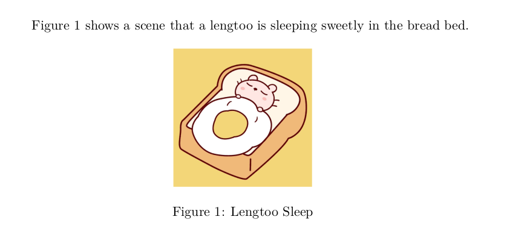

# LaTeX 结构命令

## 文档结构

如下所示是一个非常简单的 LaTeX 代码：

```latex
\documentclass{ctexart}

\begin{document}
    Hello \LaTeX
\end{document}
```

生成一个如下所示的 pdf 文档：


所有的 LaTeX 文档都必须以 `\documentclass` 命令开头，并将内容写在 `\begin{document}` 和 `\end{document}` 之间。在 `\documentclass`
命令下面，我们可以导入宏包、自定义样式、自定义命令，这在后面的教程中会经常遇到。

`\documentclass` 命令指定了 LaTeX 文档的类型，命令原型是 `\documentclass[options]{class}`。其中 `class` 用于指定文档类型，我们这里为
“ctexart”，是一篇支持中文的文章，我们还可以使用 “book”、“letter”、“slides” 等类型。此外，`options` 用于传入参数，例如纸张大小和文字大小等。下面列举了一些该命令的常见用法：

```latex
\documentclass{article}                 % 文章
\documentclass[a4paper]{article}        % 纸张大小为 A4 的文章
\documentclass[a4paper,12pt]{article}   % 纸张大小为 A4、文字大小为 12 pt 的文章
\documentclass{ctexart}                 % 支持中文的文章
\documentclass{book}                    % 书籍
\documentclass{letter}                  % 信件
\documentclass{slides}                  % 幻灯片
```

`\begin{document} ... \end{document}` 包含了该 LaTeX 文档的所有内容。下面我们会经常遇到用 `\begin{environment} ... \end{environment}`
这类闭合命令定义的环境。例如，我们使用 `\begin{figure} ... \end{figure}` 来插入图片，使用 `\begin{table} ... \end{table}`
来插入表格。此外，这些命令也同样允许传入参数，例如，`\begin{figure}[h] ... \end{figure}` 表示在当前位置插入图片，`\begin{table}[t] ... \end{table}`
表示在页面顶端插入表格。

`\LaTeX` 命令输出 “LATEX” 文字，相信你已经注意到了。但和正常输出 “LATEX” 文字所不同的是，`\LaTeX` 命令输出的文字错落有致，“A” 会小一点，“E” 会下沉一点，字间距更加紧凑。

## 标题、作者、日期

我们使用 `\title{text}` 命令指定标题，使用 `\author{name}` 命令指定作者，使用 `\date{text}` 命令指定日期。并在文档中需要生成标题的地方，使用 `\maketitle` 命令生成标题。

事实上，标题、作者、日期仅仅是语义层面上的约束，你要把作者放在 `\title` 里，把日期放在 `\author` 里，把标题放在 `\date` 里，也完全可以。例如下面的 LaTeX 代码就是这么做的：

```latex
\documentclass{article}

\title{enderman19980125}
\author{2021.06.02}
\date{Hello \LaTeX}

\begin{document}
    \maketitle
    This is my first \LaTeX document.
\end{document}
```

生成的 pdf 文档如下所示：


由此可见，`\maketitle` 命令仅仅是按照标题、作者、日期的顺序和相应格式进行渲染，而不关注里面的文字内容到底是什么。

## 段落

“空行” 和 `\par` 命令用于另起一段，就像 word 中的 “硬回车”。一般情况下，推荐使用 “空行” 另起一段。

而 `\newline` 和 `\\` 命令用于另起一行，接下来的一行没有缩进，仅是文字换行显示，并不是新的段落，就像 word 中的 “软回车”。

```latex
\documentclass{article}

\begin{document}
    This is paragraph 1.

    This is paragraph 2. \par
    This is paragraph 3. \newline
    This is new line one. \\
    This is new line two.
\end{document}
```


## 章节

`\section{title}`、`\subsection{title}`、`\subsubsection{title}` 命令分别用于定义一级章节、二级章节、三级章节。其中 `title` 参数为章节标题。

你问可不可以定义四级章节？当然，但这不是本章教程的内容。

```latex
\documentclass{article}

\begin{document}
    \section{AAA}
    This is section AAA.

    \subsection{aaa}
    This is subsection aaa.

    \subsubsection{666}
    This is subsubsection 666.

    \subsubsection{999}
    This is subsubsection 999.

    \subsection{bbb}
    This is subsection bbb.


    \section{BBB}
    This is section BBB.


    \section{CCC}
    This is section CCC.

\end{document}
```


## 目录

`\tableofcontents` 命令用于生成目录，根据一级、二级、三级章节标题自动生成。

```latex
\documentclass{article}

\begin{document}
    \tableofcontents


    \section{AAA}
    This is section AAA.

    \subsection{aaa}
    This is subsection aaa.

    \subsubsection{666}
    This is subsubsection 666.

    \subsubsection{999}
    This is subsubsection 999.

    \subsection{bbb}
    This is subsection bbb.


    \section{BBB}
    This is section BBB.


    \section{CCC}
    This is section CCC.

\end{document}
```


# LaTeX 内容命令

## 无序列表

`\begin{itemize} ... \end{itemize}` 命令用于定义一个无序列表环境，使用 `\item` 命令定义每一项的内容。

```latex
\documentclass{article}

\begin{document}

    The fast food package includes the following food:

    \begin{itemize}
        \item Hamburger
        \item French fries
        \item Cola
    \end{itemize}

\end{document}
```


## 有序列表

`\begin{enumerate} ... \end{enumerate}` 命令用于定义一个有序列表环境，使用 `\item` 命令定义每一项的内容。

```latex
\documentclass{article}

\begin{document}

    The fast food package includes the following food:

    \begin{enumerate}
        \item Hamburger
        \item French fries
        \item Cola
    \end{enumerate}

\end{document}
```


## 图片

`\begin{figure} ... \end{figure}` 命令用于定义一个图片环境，需要使用 `graphicx` 宏包。

其中，`[h]` 参数表示在当前位置 (here) 显示图片，`\centering` 命令用于居中图片，`\caption{text}` 命令定义图片的标题为 text，`\label{key}` 命令定义图片的标签为
key。标签的作用是：在文档中的任何地方，使用 `\ref{key}` 命令引用标签为 key 的对象。

`\includegraphics[key-val-list]{imagefile}` 命令导入一个图片文件并以指定格式显示。这里，我们在 `.tex` 文件所在目录下放了一张 `sleep.jpg`
图片，使用 `\includegraphics{sleep}` 命令导入这张图片，注意后缀名 `.jpg` 有没有无所谓。同时，我们使用 `[width=0.3\textwidth]` 选项让图片以 30% 的文档宽度显示。

```latex
\documentclass{article}

\usepackage{graphicx}

\begin{document}

    Figure \ref{fig:sleep} shows a scene that a lengtoo is sleeping sweetly in the bread bed.

    \begin{figure}[h]
        \centering
        \includegraphics[width=0.3\textwidth]{sleep}
        \caption{Lengtoo Sleep}
        \label{fig:sleep}
    \end{figure}

\end{document}
```



## 表格

`\begin{table} ... \end{table}` 命令用于定义一个复合的表格环境。

其中，`[h]` 参数表示在当前位置 (here) 显示表格，`\centering` 命令用于居中表格，`\caption{text}` 命令定义表格的标题为 text，`\label{key}` 命令定义表格的标签为 key。

`\begin{tabular} ... \end{tabular}` 命令用于定义一个表格环境。

其中，`|c|l|ccc|` 参数的含义是，第一列居中，第二列左对齐，第三、四、五列居中，第一列左边、第一列和第二列中间、第二列和第三列中间、第五列右边显示竖线。

单元格之间使用 `&` 分隔，行与行之间使用 `\\` 命令分隔。

`\hline` 命令显示横线，我们在第一行上面、第一行下面、第三行下面显示横线。

```latex
\documentclass{article}

\begin{document}

    Table \ref{tab:score} shows that Brown is good at Math while Cony does well in Chinese and English.

    \begin{table}[h]
        \centering
        \caption{Score of Class}
        \label{tab:score}
        \begin{tabular}{|c|l|ccc|}
            \hline
            No. & Name  & Chinese & Math & English \\ \hline
            1   & Brown & 70      & 100  & 80      \\
            2   & Cony  & 90      & 80   & 90      \\ \hline
        \end{tabular}
    \end{table}

\end{document}
```


## 数学公式

`$ ... $` 命令定义行内公式，即公式就在原地显示。`\[ ... \]` 命令定义换行公式，即公式占用单独的一行并居中显示。

`\begin{equation} ... \end{equation}` 命令用于定义一个公式环境。公式环境会为公式编号，并支持标签引用。

```latex
\documentclass{article}

\begin{document}

    $x$ is a variable, the integration of \[\frac{1}{1+x^{2}}\] is shown as Equation \ref{eq:int}.

    \begin{equation}
        \int \frac{1}{1+x^{2}} \mathrm{d}x = \arctan x + C
        \label{eq:int}
    \end{equation}

\end{document}
```


## 代码

`\begin{lstlisting} ... \end{lstlisting}` 命令用于定义一个代码环境，需要使用 `listings` 宏包。

代码环境同样支持标签引用。同时，我们可以指定编程语言，以高亮显示关键字和字符串等内容。

```latex
\documentclass{article}

\usepackage{listings}

\begin{document}

    Use Python to read and write *.csv files is easy.
    The demo code shows as Listing \ref{lst:csv}.

    \begin{lstlisting}[language=Python,caption={Use Python to read and write *.csv files},label={lst:csv}]
import csv

with open('demo.csv', 'r') as file:
    reader = csv.reader(file)
    rows_list = list(reader)

with open('demo.csv', 'w')as file:
    writer = csv.writer(file)
    writer.writerow(['h1', 'h2', 'h3'])
    writer.writerows([[1, 2, 3], [4, 5, 6]])
    \end{lstlisting}

\end{document}
```


## 参考文献

LaTeX 的一大好处就是引用和排版参考文献非常方便。只需要两行命令，我们就可以在文档中引用参考文献，并且 BibTeX 会自动生成参考文献引用列表。

`\bibliographystyle{style}` 命令定义参考文献的格式。这里，我们使用 `unsrt`，它会根据文档中参考文献的引用次序，生成顺序编号并排列的参考文献列表。

`\bibliography{bibliographyfile}` 命令导入参考文献的 .bib 文件。这里，我们使用 `references.bib` 文件，并使用 `\bibliography{references}` 命令导入该
.bib 文件。

在文档中，我们使用 `\cite{keys}` 命令引用参考文献，我们可以在 .bib 文件中自定义每篇参考文献的 `key`。

```latex
\documentclass{article}

\begin{document}

    Bigtable\cite{big-table} is a distributed storage system for structured data.

    Attention mechanism\cite{attention} is widely used in deep neural network to extract key information.

    \bibliographystyle{unsrt}
    \bibliography{references}

\end{document}
```

`references.bib` 文件内容：

```bibtex
@article{big-table,
    title = {Bigtable: A distributed storage system for structured data},
    author = {Chang, Fay and Dean, Jeffrey and Ghemawat, Sanjay and Hsieh, Wilson C and Wallach, Deborah A and Burrows, Mike and Chandra, Tushar and Fikes, Andrew and Gruber, Robert E},
    journal = {ACM Transactions on Computer Systems (TOCS)},
    volume = {26},
    number = {2},
    pages = {1--26},
    year = {2008},
    publisher = {ACM New York, NY, USA}
}

@inproceedings{attention,
    title = {Attention is all you need},
    author = {Waswani, A and Shazeer, N and Parmar, N and Uszkoreit, J and Jones, L and Gomez, AN and Kaiser, L and Polosukhin, I},
    booktitle = {NIPS},
    year = {2017}
}
```


